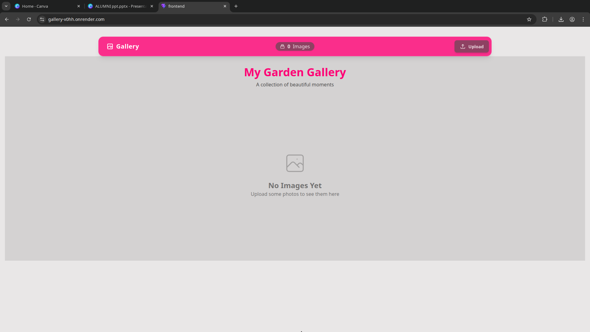
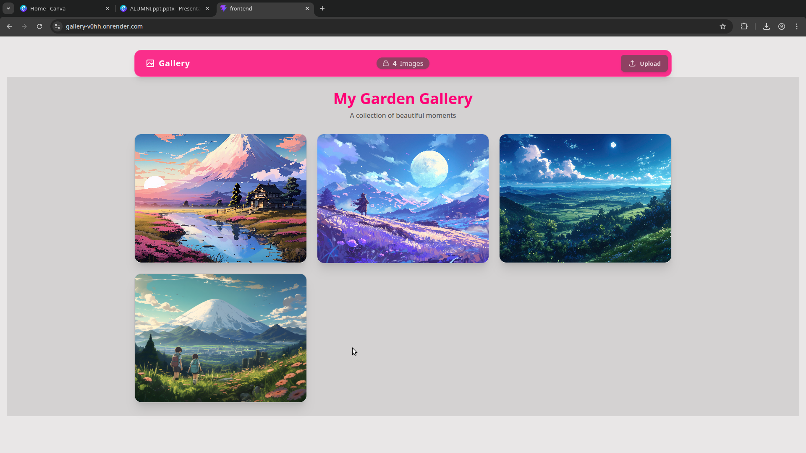
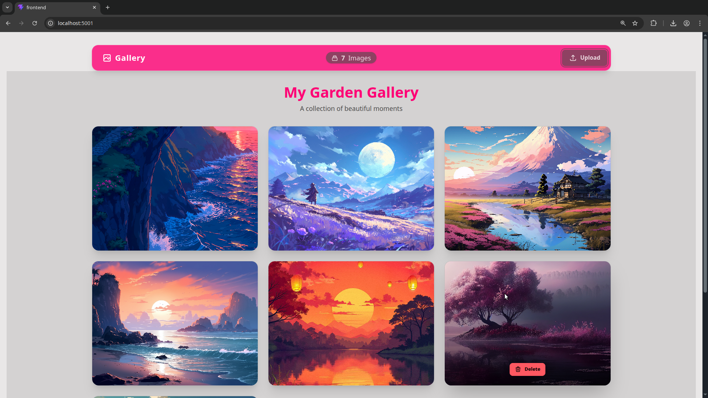
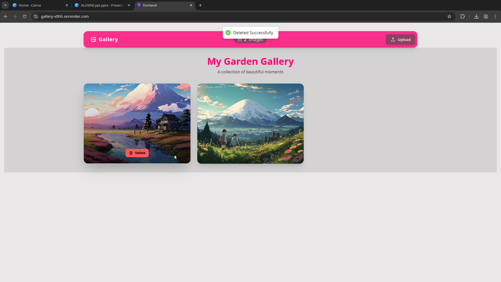

<div align="center">

# 📸 Photo Gallery

### A Modern, Responsive Full-Stack MERN Application for Personal Photo Management


</div>

---

## 🌟 Project Overview

The **Photo Gallery** is a modern, responsive full-stack MERN application designed for personal photo management. It allows users to **upload**, **view**, and **delete** images in a beautiful, masonry-style gallery interface. The project focuses on **simplicity**, **speed**, and a **clean user experience**.

---

## 🖼️ Screenshots

<div align="center">

### 🏠 Home Page — Empty State
<p><em>Clean, minimal interface welcoming users to upload their first photos</em></p>


<br><br>

### 🎨 Gallery View — Main Interface
<p><em>Beautiful masonry grid showcasing uploaded images with the Garden theme</em></p>


<br><br>

### 🖼️ Full Image Grid
<p><em>Responsive layout adapting to different screen sizes with smooth hover effects</em></p>


<br><br>

### 🗑️ Delete Option — Hover Action
<p><em>Intuitive delete button appears on hover for quick image removal</em></p>


</div>

---

## 🛠️ Technologies Used

### Frontend
| Technology | Version | Purpose |
|:-----------|:-------:|:--------|
| **React** | v19 | Modern UI library for building components |
| **Vite** | Latest | Lightning-fast build tool and development server |
| **Tailwind CSS** | v4 | Utility-first CSS framework for rapid styling |
| **DaisyUI** | v5 | Component library for Tailwind CSS providing modern themes |
| **Zustand** | — | Lightweight state management for handling application state |
| **Axios** | — | Promise-based HTTP client for making API requests |
| **React Hot Toast** | — | Elegant notifications for success and error feedback |

### Backend
| Technology | Purpose |
|:-----------|:--------|
| **Node.js & Express** | Robust server-side runtime and web framework |
| **MongoDB** | NoSQL database for storing image data |
| **Mongoose** | ODM for MongoDB to handle data modeling |
| **Multer** | Middleware for handling multipart/form-data (image uploads) |
| **CORS** | Cross-Origin Resource Sharing for secure frontend-backend communication |
| **Dotenv** | Environment variable management |

---

## ✨ Core Functionalities

### 📤 Image Upload
Users can select images from their local device. Images are processed as `multipart/form-data` and stored directly in MongoDB as **Base64 strings**.

### 🎨 Dynamic Gallery View
A responsive masonry grid that automatically adjusts based on screen size (Mobile, Tablet, Desktop). It features a **"Garden" theme** with smooth hover effects.

### 🔢 Real-time Image Counter
The navigation bar displays a live count of the total photos in the gallery.

### 🗑️ Image Deletion
Users can remove images with a single click. The UI updates instantly to reflect the change without requiring a page reload.

### 🔔 Feedback System
Real-time toast notifications confirm when an image is successfully uploaded or deleted, and provide alerts in case of errors.

### 🪟 Backdrop Blur Navigation
A sticky, modern navigation bar with glassmorphism effects.

---

## ✅ Advantages

| Advantage | Description |
|:----------|:------------|
| **⚡ High Performance** | Built with Vite and Zustand, ensuring a very fast and snappy user experience. |
| **📱 Mobile Responsive** | Fully optimized for all devices using Tailwind's responsive utilities. |
| **💾 Zero Setup Storage** | Uses Base64 encoding to store images directly in the database, eliminating the need for external storage services (like AWS S3) for simple use cases. |
| **🎨 Modern UI/UX** | Utilizes professional-grade design patterns, including masonry layouts and interactive feedback. |
| **🏗️ Clean Architecture** | Organized folder structure separating concerns between controllers, routes, models, and frontend components. |

---

## ⚠️ Disadvantages

| Disadvantage | Description |
|:-------------|:------------|
| **💾 Database Size** | Storing images as Base64 strings in MongoDB can lead to large database sizes and performance issues if handling very high-resolution files or a massive number of images. |
| **🔓 No Authentication** | The current version does not include user login, meaning anyone can upload or delete photos. |
| **📄 No Pagination** | All images are loaded at once, which could slow down the application as the gallery grows significantly. |

---

## 🚀 How to Run the Project

### Prerequisites
- Node.js (v18 or higher)
- MongoDB (local or Atlas)
- npm or yarn

```
npm run build 
npm run start
```

### Access the Application
- **Project Running on**: http://localhost:5000

---

<div align="center">

### 🌸 My Garden Gallery
*A collection of beautiful moments*

</div>
